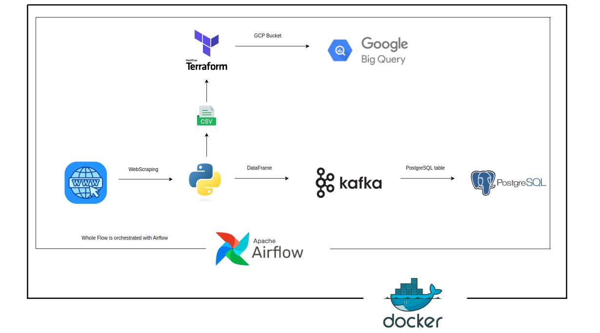
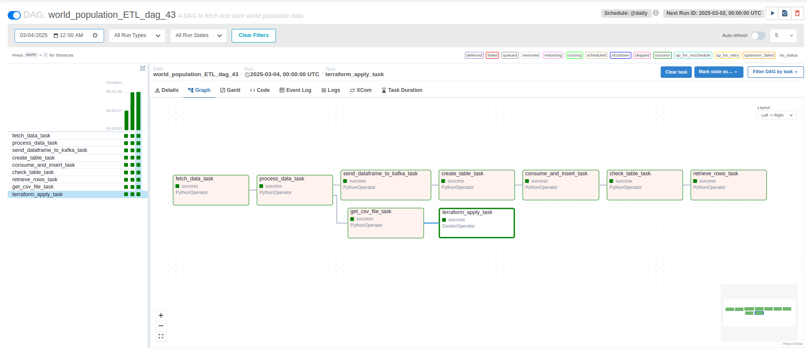
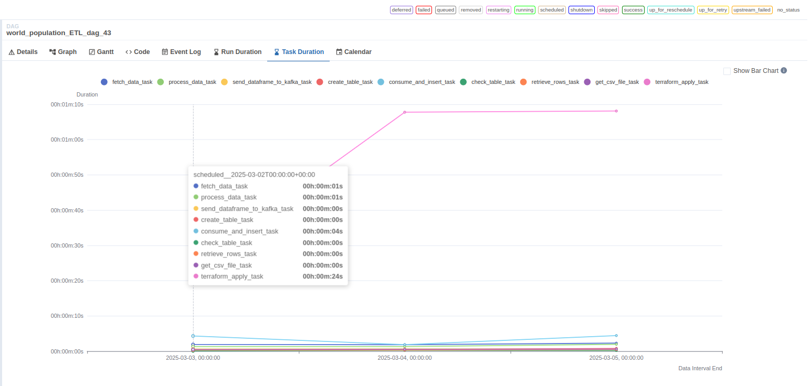

# DE - ZOOMCAMP - PROJECT

### ETL Pipeline

#### Overview
This project is a fully automated ETL (Extract, Transform, Load) pipeline designed to extract data from a website, process it using Apache Airflow, and store it in PostgreSQL and Google BigQuery. It supports both batch processing and real-time data streaming using Kafka. The entire system is containerized using Docker and managed via Docker Compose.

#### Data Source
The project use open data source provided by Worldometers. For simplicity, the project uses:
#### https://www.worldometers.info/world-population/population-by-country/

### Key Features
#### 1. Data Extraction
* Uses a Python-based web scraper to extract data from a website(BeautifulSoup).
* Ensures data consistency before loading into the next stage.
#### 2. Workflow Orchestration with Apache Airflow
* Automates data extraction, transformation, and loading.
* Automates Terraform task and uploading data to BigQuery.
* Automates Kafka task to fetch and insert data in POstgreSQL database.
#### 3. Data Storage and Processing
* PostgreSQL acts as the intermediate storage layer.
* Google BigQuery is used for scalable data analytics.
#### 4. Real-Time Streaming with Kafka
* Uses Kafka topics to stream data from PostgreSQL to BigQuery.
* Data ingested from Python Dataframe and PostgreSQL as consumer.
#### 5. Infrastructure as Code (IaC) with Terraform
* Terraform scripts automate the setup of BigQuery resources and uploads data in it.
* Automated reproducible deployment.
#### 6. Containerized Deployment
* Uses Docker Compose to manage PostgreSQL, Kafka, Airflow, and Terraform.
* Each service runs in its own isolated container.

### Flow Architecture:






### Prerequisites:
* Docker & Docker Compose
* Python
* Airflow
* PostgreSQL
* Google Cloud SDK (for BigQuery authentication)

### Setup Instructions:
1) Clone the Repository
   * ```git clone https://github.com/Giko20/DataTalks-Data-Engineering-Project.git/```
   * ```cd DataTalks-Data_Engineering-Project```
2) Set Up Environment Variables
   Create a ```.env``` file in the project directory and configure it with your details:
   ```
      POSTGRES_USER=your_user
      POSTGRES_PASSWORD=your_password
      POSTGRES_DB=etl_db
      KAFKA_BROKER=kafka:9092
      BIGQUERY_PROJECT=your_project_id
      BIGQUERY_DATASET=your_dataset_name
   ```
3) Start the Docker Containers
   ```
   docker-compose up -d --build
   ```
   this command will start all services.


## After that watch and enjoy 💯
